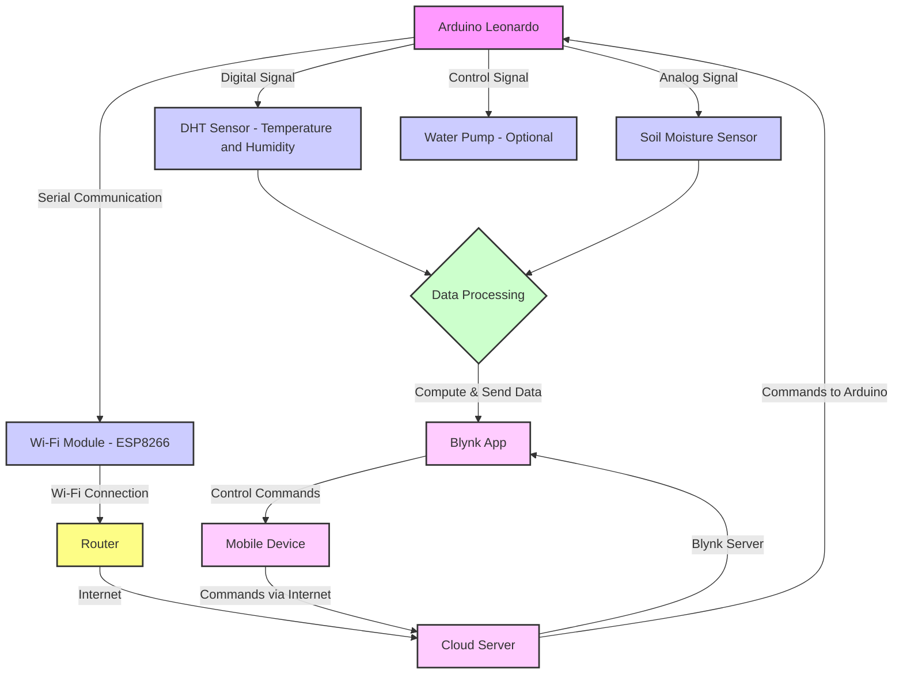

# Ecoduino Automatic Watering System

The Ecoduino Automatic Watering System is a project that aims to automate the process of watering plants. It utilizes a microcontroller and various sensors to monitor the moisture level of the soil and trigger the watering mechanism when necessary.

## Features

- Automatic watering based on soil moisture level
- Adjustable watering schedule
- Real-time monitoring of soil moisture level
TODO:
- Notifications and alerts
- Integration with an ESP module and control via Blynk

## Getting Started

### Prerequisites

- Ecoduino microcontroller board (which is just a modified Arduino Leonardo)
- Soil moisture sensor
- Water pump
- Power supply

### Installation

1. Clone the repository: `git clone https://github.com/waleedayoub/ecoduino.git`
2. Connect the Ecoduino board to your computer via USB.
3. In VSCode, install the PlatformIO extension
4. Configure the settings in the `platformio.ini` file according to your setup.
5. Upload the code to the Ecoduino board using PlatformIO.

### Usage

1. Connect the soil moisture sensor to the Ecoduino board.
2. Connect the water pump to the Ecoduino board.
3. Power on the Ecoduino board.
    - An important consideration here are the power requirements for the water pump
    - A standard 5v power supply won't cut it, you'll need at least 9V (I ended up using a 12v power supply I had lying around)
4. The system will automatically start monitoring the soil moisture level and watering the plants when necessary.

### Schematic

